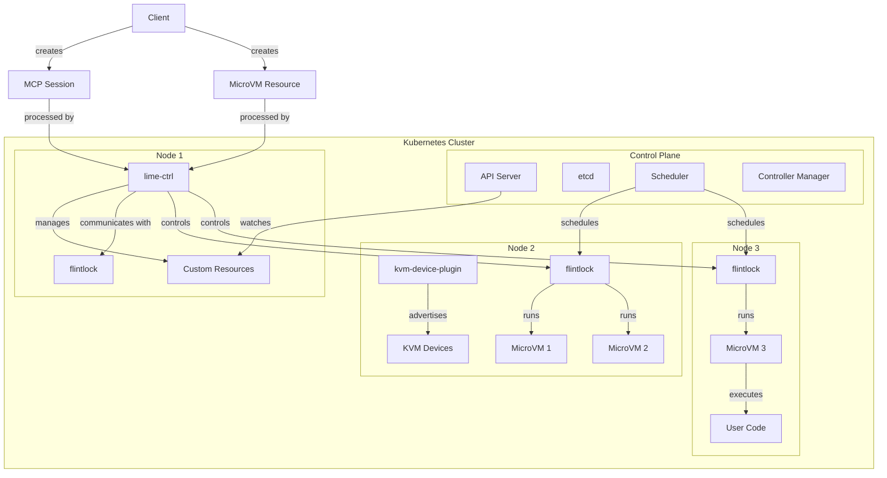

<<<<<<< HEAD
# Trashfire Vending Machine (TVM)
=======
# Trashfire Dispensing Machine (TVM)
>>>>>>> 10bfa50 (Squashed history)

A Kubernetes-native solution for managing lightweight virtual machines using Firecracker. It enables users to create, manage, and execute code within isolated microVMs, with support for Model Context Protocol (MCP) sessions.

## Overview

<<<<<<< HEAD
Trashfire Vending Machine (TVM) consists of several components:

```
┌─────────────────────────────────────────────────────────────────┐
│                       Kubernetes Cluster                         │
│                                                                  │
│  ┌───────────────┐    ┌───────────────┐    ┌───────────────┐    │
│  │     Node 1    │    │     Node 2    │    │     Node 3    │    │
│  │               │    │               │    │               │    │
│  │ ┌───────────┐ │    │ ┌───────────┐ │    │ ┌───────────┐ │    │
│  │ │ lime-ctrl │ │    │ │kvm-device-│ │    │ │firecracker│ │    │
│  │ │           │ │    │ │  plugin   │ │    │ │   host    │ │    │
│  │ └───────────┘ │    │ └───────────┘ │    │ └───────────┘ │    │
│  │       │       │    │       │       │    │       │       │    │
│  │       ▼       │    │       ▼       │    │       ▼       │    │
│  │ ┌───────────┐ │    │ ┌───────────┐ │    │ ┌───────────┐ │    │
│  │ │  MicroVM  │ │    │ │  MicroVM  │ │    │ │  MicroVM  │ │    │
│  │ │           │ │    │ │           │ │    │ │           │ │    │
│  │ └───────────┘ │    │ └───────────┘ │    │ └───────────┘ │    │
│  └───────────────┘    └───────────────┘    └───────────────┘    │
└─────────────────────────────────────────────────────────────────┘
```
=======
Trashfire Dispensing Machine (TVM) is a comprehensive platform that provides secure, isolated environments for code execution using Firecracker microVMs orchestrated by Kubernetes. The system is designed for high performance, security, and scalability, making it ideal for running untrusted code in production environments.

### Architecture Diagram



The system uses a microservices architecture with the following key components:
>>>>>>> 10bfa50 (Squashed history)

## Components

### lime-ctrl
The lime-ctrl component is a Kubernetes controller that manages MicroVM custom resources. It provides:
<<<<<<< HEAD
- API server for creating, managing, and executing code in microVMs
- Integration with Kubernetes for resource management
- Support for MCP sessions
- One-time code execution capabilities

### kvm-device-plugin
The kvm-device-plugin is a Kubernetes device plugin that:
- Discovers and advertises KVM devices to the Kubernetes cluster
- Allocates KVM devices to pods that request them
- Monitors the health of KVM devices

### flintlock
The flintlock component:
- Runs Firecracker microVMs
- Manages VM lifecycle (start, stop, snapshot)
- Provides isolation between VMs
- Executes commands within VMs
=======
- **API Server**: RESTful API for creating, managing, and executing code in microVMs
- **Controller Logic**: Implements reconciliation loops for custom resources
- **Resource Management**: Integrates with Kubernetes for efficient resource allocation
- **MCP Protocol Support**: Implements the Model Context Protocol specification
- **Execution Engine**: Coordinates code execution across microVMs
- **State Management**: Maintains the state of all running VMs and sessions
- **Metrics Collection**: Gathers performance and usage metrics

### kvm-device-plugin
The kvm-device-plugin is a Kubernetes device plugin that:
- **Device Discovery**: Automatically detects KVM capabilities on nodes
- **Resource Advertising**: Exposes KVM devices to the Kubernetes scheduler
- **Resource Allocation**: Manages exclusive access to KVM devices
- **Health Monitoring**: Continuously checks device health and availability
- **Resource Cleanup**: Ensures proper release of resources when pods terminate
- **Metrics Reporting**: Provides utilization metrics for capacity planning

### flintlock
The flintlock component:
- **VM Orchestration**: Manages the lifecycle of Firecracker microVMs
- **Snapshot Management**: Creates and restores VM snapshots for fast startup
- **Network Configuration**: Sets up virtual network interfaces for VM connectivity
- **Storage Management**: Handles VM disk images and persistent storage
- **Command Execution**: Securely executes commands within VMs
- **Resource Isolation**: Enforces CPU, memory, and I/O limits
- **Logging & Monitoring**: Captures VM logs and performance metrics
>>>>>>> 10bfa50 (Squashed history)

## Custom Resources

### MicroVM
The MicroVM Custom Resource Definition (CRD) defines the schema for microVMs in Kubernetes:
<<<<<<< HEAD
- VM specifications (CPU, memory, image)
- VM status and lifecycle information
- Support for snapshots and persistent storage

### MCPSession
The MCPSession CRD defines the schema for MCP sessions:
- Session specifications (user, group, VM)
- Session status and activity information
- Connection details

## Features

- **Isolated Execution**: Run code in isolated microVMs for security and resource control
- **MCP Support**: Use the Model Context Protocol to interact with models
- **Kubernetes Native**: Fully integrated with Kubernetes for orchestration and management
- **Cross-Platform**: Works on both Linux and non-Linux platforms (with some limitations)
- **Resource Efficiency**: Lightweight VMs with minimal overhead
=======
```yaml
apiVersion: apiextensions.k8s.io/v1
kind: CustomResourceDefinition
metadata:
  name: microvms.vvm.tvm.github.com
spec:
  group: vvm.tvm.github.com
  versions:
    - name: v1alpha1
      served: true
      storage: true
      schema:
        openAPIV3Schema:
          type: object
          properties:
            spec:
              type: object
              properties:
                image:
                  type: string
                  description: "Container image to use for the microVM"
                cpu:
                  type: integer
                  description: "Number of vCPUs to allocate"
                memory:
                  type: integer
                  description: "Memory in MB to allocate"
                mcpMode:
                  type: boolean
                  description: "Enable MCP protocol support"
```

### MCPSession
The MCPSession CRD defines the schema for MCP sessions:
```yaml
apiVersion: apiextensions.k8s.io/v1
kind: CustomResourceDefinition
metadata:
  name: mcpsessions.vvm.tvm.github.com
spec:
  group: vvm.tvm.github.com
  versions:
    - name: v1alpha1
      served: true
      storage: true
      schema:
        openAPIV3Schema:
          type: object
          properties:
            spec:
              type: object
              properties:
                userId:
                  type: string
                  description: "User identifier"
                groupId:
                  type: string
                  description: "Group identifier"
                vmId:
                  type: string
                  description: "Reference to MicroVM resource"
```

## Technical Features

- **Isolated Execution Environment**:
  - Firecracker-based microVMs provide hardware-level isolation
  - Each execution environment has its own kernel and filesystem
  - Memory and CPU resources are strictly isolated between VMs

- **MCP Protocol Implementation**:
  - Full support for the Model Context Protocol specification
  - Bidirectional streaming for real-time communication
  - Support for tool definitions and resource access

- **Kubernetes Native Architecture**:
  - Custom controllers and CRDs for declarative management
  - Integration with Kubernetes RBAC for access control
  - Leverages Kubernetes scheduling and resource management

- **High Performance**:
  - Sub-second VM boot times using optimized kernels
  - Minimal memory overhead compared to containers
  - Efficient resource utilization with dynamic scaling

- **Security Features**:
  - VM-level isolation prevents privilege escalation
  - Immutable root filesystems for predictable execution
  - Network policies for controlling VM communication
>>>>>>> 10bfa50 (Squashed history)

## Getting Started

### Prerequisites
- Kubernetes cluster
- KVM-enabled nodes (for Linux)
- Lima (for macOS)

### Installation
1. Apply the CRDs:
   ```
   kubectl apply -f deploy/crds/
   ```

2. Deploy the components:
   ```
   kubectl apply -f deploy/
   ```

### Usage

#### Creating a MicroVM
```yaml
apiVersion: vvm.tvm.github.com/v1alpha1
kind: MicroVM
metadata:
  name: test-microvm
spec:
  image: ubuntu:20.04
  cpu: 1
  memory: 512
  mcpMode: true
```

#### Creating an MCP Session
```yaml
apiVersion: vvm.tvm.github.com/v1alpha1
kind: MCPSession
metadata:
  name: test-session
spec:
  userId: user123
  groupId: group456
  vmId: test-microvm
```

#### Executing Code
```bash
./scripts/vvm.sh execute "print('Hello from Firecracker!')"
```

## Why "Trashfire Vending Machine"?

Because sometimes you need a quick, disposable environment to run potentially dangerous code - like getting a snack from a vending machine that might be on fire. It's convenient, isolated, and you can walk away when you're done!

## License

This project is licensed under the MIT License - see the LICENSE file for details.